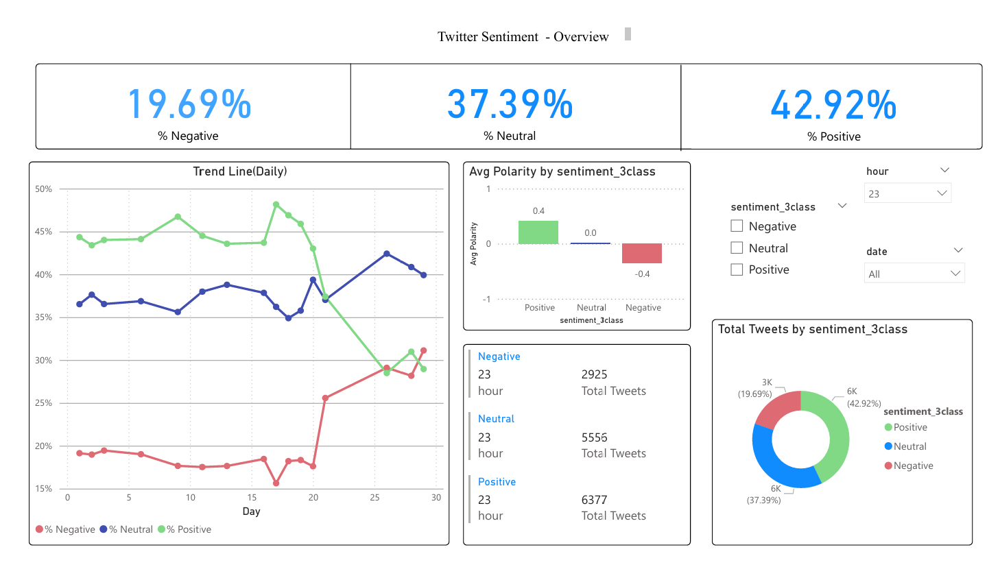

# Twitter Sentiment Analytics Dashboard

## Overview
A sentiment analytics workflow built with Python, Jupyter Notebook, and Power BI to turn raw Twitter data into a portfolio-ready reporting layer. The project focuses on text preparation, polarity-based sentiment scoring, analytical feature engineering, and dashboard design for time-based sentiment analysis.

## Objectives
- Prepare tweet data for consistent downstream analysis.
- Derive text and time features that support business-facing reporting.
- Apply TextBlob polarity scoring and map results into Positive, Neutral, and Negative sentiment classes.
- Export clean analytical tables for Power BI modeling and visualization.

## Dataset

- The original dataset is not included due to file size limitations.
- You can download it from:
    https://www.kaggle.com/datasets/kazanova/sentiment140
- Place the file in:
    data/Twitter(X)-Raw_Data-2009.csv

## Methodology
- Clean tweet text with lowercase normalization, regex-based noise removal, and token-ready formatting.
- Parse timestamps into date and hour dimensions for temporal aggregation.
- Engineer descriptive features including `word_count`, `text_len`, URL flags, mention flags, and hashtag flags.
- Compute sentiment polarity with TextBlob on cleaned text.
- Convert polarity scores into 3-class sentiment labels using threshold-based rules.

## Data Pipeline
1. Load the raw Twitter dataset in the notebook.
2. Clean and standardize text fields.
3. Generate time and text-derived features.
4. Score tweet polarity and assign 3-class sentiment labels.
5. Aggregate tweet data into daily and hourly summary tables.
6. Export analysis-ready CSV files to `outputs/`.
7. Build the Power BI dashboard from the exported tables.

Primary outputs:

- `outputs/daily_summary_3class.csv`
- `outputs/fact_tweets_3class.csv`
- `outputs/hourly_summary_3class.csv`
- `outputs/tweet_text_sample.csv`

## Dashboard Insights
- Positive sentiment: `42.92%`
- Neutral sentiment: `37.39%`
- Negative sentiment: `19.69%`
- Total tweets displayed: approximately `76K`
- Average polarity: approximately `0`
- Average word count: `10.86`

The dashboard also highlights daily sentiment movement, hourly tweet volume, average polarity by sentiment class, and text characteristics that help contextualize how tweets differ across categories.

## Dashboard Preview



[View Full Dashboard (PDF)](dashboard/TwitterSentimentAnalysisDataVisualization.pdf)

## Project Structure
```text
.
├── data/
│   └── Twitter(X)-Raw_Data-2009.csv
├── notebooks/
│   └── Twitter_Sentiment_Analytics.ipynb
├── outputs/
│   ├── daily_summary_3class.csv
│   ├── fact_tweets_3class.csv
│   ├── hourly_summary_3class.csv
│   └── tweet_text_sample.csv
├── dashboard/
│   ├── dashboard_overview.png
│   ├── TwitterSentimentAnalysisDataVisualization.pbix
│   └── TwitterSentimentAnalysisDataVisualization.pdf
├── .gitignore
├── README.md
└── requirements.txt
```

## How to Run
1. Create and activate a virtual environment.
2. Install dependencies with `pip install -r requirements.txt`.
3. Open `notebooks/Twitter_Sentiment_Analytics.ipynb`.
4. Run the notebook to regenerate the CSV exports in `outputs/`.
5. Open `dashboard/TwitterSentimentAnalysisDataVisualization.pbix` in Power BI Desktop and refresh the model if needed.

## Future Improvements
- Replace fixed polarity thresholds with a more robust sentiment calibration strategy.
- Add modular scripts for reproducible preprocessing and export generation outside the notebook.
- Extend dashboard interactivity with comparative views by date range or sentiment segment.
